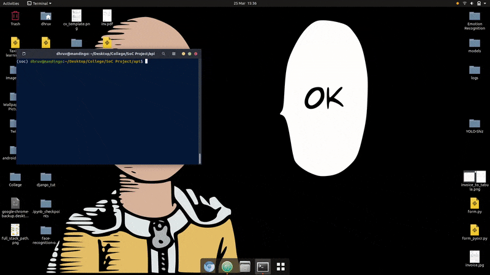
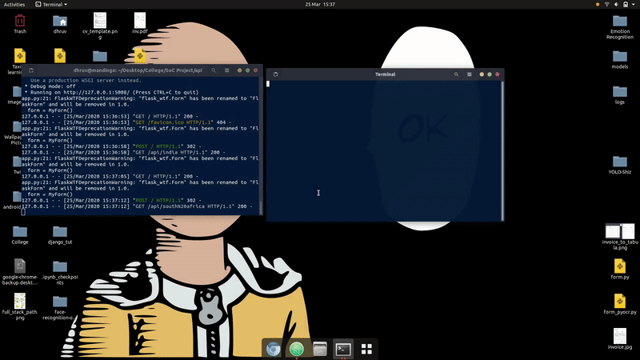

# Independence-Day-microservice
### A minimal microservice that returns the Independence day and the unicode for a flag of a country, made using Flask.

## The Idea
To make a microservice using Flask to return the Independence Day of a given country along with the unicode for it's flag.
The list of countries and their independence days was scraped from Wikipedia.

## Indy Day in action

## Requirements
* Flask 1.1.1
* Flask WTF
* emoji-country-flag 1.2.1
* pycountry 19.8.18

Once you have all the requirements down, launch using `python app.py`, and follow the link to see it in action.

## Architecure(but not really) overview:

